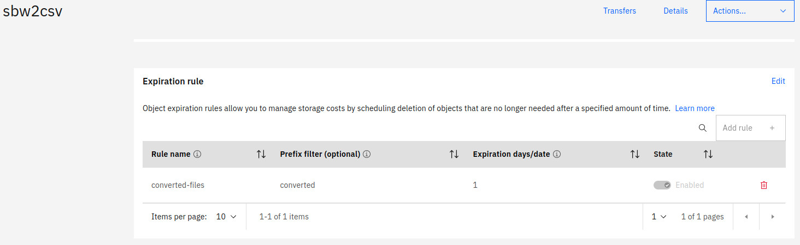
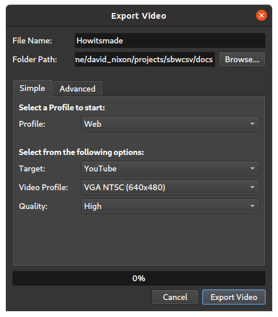
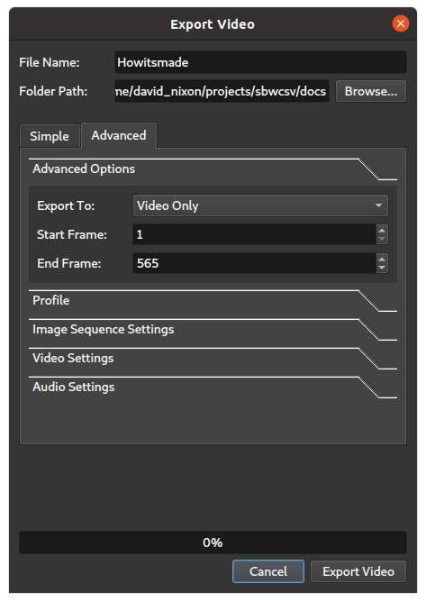
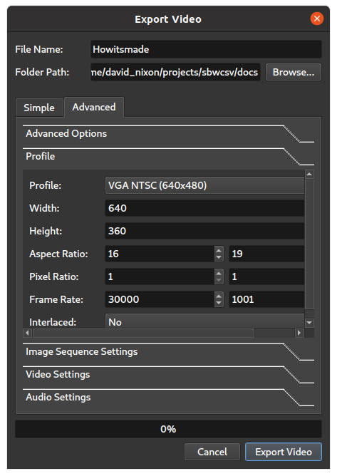

# Convert Your Savings Bond Wizard File to CSV

You can see this code running here: [Convert Your Savings Bond Wizard File](https://sbw2csv.us-east.mybluemix.net/#/)

The US Treasury Department used to have a
Savings Bond Wizard that let you track and identify the purchased
bonds. But the SBW file is no longer supported so this app will let you convert them to CSV files.

Thanks to Jim Evins and the [GBonds project](http://gbonds.sourceforge.net/) for the nucleolus of this code.

Thanks to Lionel Villard et al and the [IBM expressjs-openwhisk](https://github.com/IBM/expressjs-openwhisk) project for the inspiration to use Express as an implementation for IBM Functions.

## How Its Made


### Vue.js + @carbon/vue

This part was the simplest to execute. The app itself is pretty simple with just a landing page and simple privacy statement. I use a custom theme for Carbon that includes a few tweaks to match some colors from the US Treasury site. Everything else is standard.

You can launch the site locally with:

```sh
cd ui
yarn
yarn serve
```

### Deploying the UI

Deployment of the UI is straightforward with just a bit of a reverse proxy incantation to to hide the services and cloud object storage layers.

Deployment starts with `yarn build` which, of course, creates a production version of the app in the `dist` directory. The output is served by Nginx via the [Nginx buildpack](https://github.com/cloudfoundry/nginx-buildpack). You can see the details of that in [cf/manifest.yml](cf/manifest.yml) and [cf/nginx.conf](cf/nginx.conf)

The config creates a reverse proxy for `/services/` which points to the deployed IBM Function via the environment variable `SERVICES_URL`. It also creates a reverse proxy to the Cloud Object Storage under `/downloads/` the URL for which is defined by the environment variable `COS_DOWNLOAD`

### Services layer

You can find the code for this in the [services](services) directory. I bootstrapped this layer with `express --view=pug services` and then customized it for this app. The most important endpoint is [services/routes/convert.js](services/routes/convert.js) which receives uploaded files, converts them to CSV, and then stores them in the COS.

The only other interesting endpoint is in [services/routes/analytics.js](services/routes/analytics.js) which accepts analytic posts from the UI. It takes that data and stores it in a connected cloudant db. This is a experiment at this point and not really relevant to this solution. If you want real analytics you should look elsewhere.

### C++ Command line utility

The `convert` endpoint uses this utility to do its work. The code from the gbonds application already had an import for SBW files so those dependencies are in the `cli/deps/gbonds-2.0.3/` directory. I added a little glue around that in `cli/main.cpp` to export the files to CSV format.

Then the only trick is to compile it so that it is compatible with the stack running the action (`cflinuxfs3`). For that I use the Docker file in th `cli` directory.

Incidentally, you can build the command line utility locally like this:

```sh
cd cli
cmake -S . -Bbuild
cmake --build build/
```

That works great for me on Ubunto 20 but likely needs updats for OSX and Windows. LMK if you make changes and I'll merge them in.

### Deploying the Services

You can see most of this in the [build.sh](build.sh) but these are basic steps:

```sh
docker run --rm -v $(pwd):/app/sbwcli sbw2csv-builder:latest
cp webbuild/sbw2csv ../services/bin
# ..
zip -r app.zip .
ibmcloud functions deploy
```

The function expects to be connected to a COS instance and to a Cloudant instance (for the analytics). Use your
cloud account to generate write access keys for these services and then connect them to the Actions.

```sh
ibmcloud functions service bind cloud-object-storage \
    sbw2csv/sbw2csvServices \
    --instance YOUR-COS-INSTANCE \
    --keyname sbw2csv-service


ibmcloud functions service bind cloudantnosqldb \
    sbw2csv/sbw2csvServices 
    --instance YOUR-CLOUDANT-INSTANCE 
    --keyname sbw2csv-service
```

The action uses the parameter `COS_ENDPOINT` to find the COS endpoint so make sure that it defined correctly for your environment. You can see in the manifest file that it defaults to the private endpoint for us-east so the private endpoint for your region should work for you.

The action also uses the parameter `COS_BUCKET` to find the bucket in the COS. Define this for your environment and be sure to create the bucket in your environment. The code does not attempt to create the bucket. It expects it to already exist.

When you create the bucket be sure to set the expiration rule to automatically remove objects.



### Local db

If you want to try out the simple analytics locally, you should create a local db for this. You can do that like this:

```sh
cd database
yarn
yarn serve
```

This will automatically create and run local couchdb image that the services layer can connect to.

### How to Make the How Its Made Illustration

- Edit the `doc/HowItsMade.odp`
- Record illustration with [recordmydesktop](http://recordmydesktop.sourceforge.net/about.php)
- Edit recording with [OpenShot](https://www.openshot.org/)

  
  
  

- Process to gif [How to make GIFs with FFMPEG](https://engineering.giphy.com/how-to-make-gifs-with-ffmpeg/)
  ```sh
  ffmpeg -y -i Howitsmade.mpeg -filter_complex "[0:v] palettegen" palette.png
  ffmpeg -y -i Howitsmade.mpeg -i palette.png  -filter_complex "[0:v][1:v] paletteuse" Howitsmade.gif
  ```

### Build

There is a local build script that prepares everything for deployment. You can find that in [build.sh](build.sh).

That script builds the services, cli, and UI and prepares them for deployment. The build output is written to `build`.

```sh
./build.sh
```

#### Deployment notes

Make sure you are fully targeted including the resource group

```sh
ibmcloud target
```

```
API endpoint: https://cloud.ibm.com
Region: us-east
User: example@example.com
Account: aaa
Resource group: ggg
CF API endpoint: https://api.us-east.cf.cloud.ibm.com (API version: 2.167.0)
Org: ooo
Space: sss

```

#### Deploy action

```sh
cd build/action
ibmcloud functions deploy
```

#### List service credentials

```sh
ibmcloud resource service-instances
```

#### Add service credentials

```sh
ibmcloud functions service bind cloud-object-storage sbw2csv/sbw2csvServices --instance YOUR-COS-INSTANCE --keyname sbw2csv-service


ibmcloud functions service bind cloudantnosqldb sbw2csv/sbw2csvServices --instance YOUR-CLOUDANT-INSTANCE --keyname sbw2csv-service

```

#### Deploy UI

```sh
cd build/cf
ibmcloud cf push --no-start
ibmcloud cf set-env COS_DOWNLOAD YOUR-PUBLIC-DOWNLOAD-URL
ibmcloud cf set-env SERVICES_URL YOUR-ACTION-URL
ibmcloud cf start sbw2csv
```

## Development setup

pre-reqs

- [yarn](https://classic.yarnpkg.com/en/docs/install/)
- [nvm](https://github.com/nvm-sh/nvm)
- node 12 `nvm install 12`
- [docker](https://docs.docker.com/get-docker/)
  - podman on RedHat works too
- [cmake](https://cmake.org/install/)
- [gcc](https://linuxize.com/post/how-to-install-gcc-on-ubuntu-20-04/)
- [boost](https://www.boost.org/doc/libs/1_77_0/more/getting_started/unix-variants.html)

- start database - open a new terminal

  ```sh
  cd database
  yarn
  yarn serve # this takes a few minutes
  ```

- build the sbw2csv cli

  ```sh
  cd cli
  cmake -S . -Bbuild/
  cmake --build build/
  cp build/sbw2csv ../services/bin/
  ```

- start services - open a new terminal

  ```sh
  cd services
  yarn
  yarn serve
  ```

  **NOTE**: If you want your local environment to connect to a remote COS, add your \_\_bx_creds to a `.env.json` file and restart your services.

- start UI - open a new terminal
  ```sh
  cd ui
  yarn
  yarn serve
  ```
